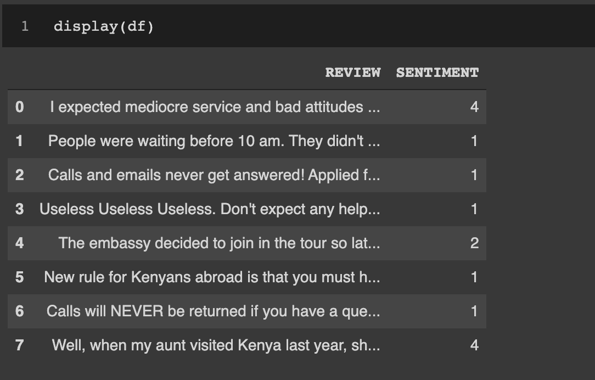

# Yelp Review Sentiment Analysis
I used `BERT Neural Network`, `Python`, and `BeautifulSoup` to scrape Yelp reviews of the `Kenyan Embassy in Washington, DC` and extract sentiment from the reviews.

## Usage
You can use the notebook to scrape and derive sentiment for any establishment with reviews on Yelp.

## Visual
Screenshot visual of the reviews and sentiment analysis `1-5 star rating`

